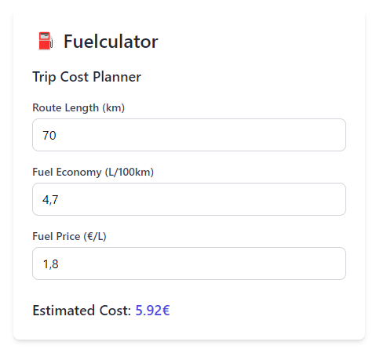

# FuelCulator 🚗⛽️

**FuelCulator** is a simple and modern web app designed to help you calculate the cost of your trips based on distance, fuel economy, and fuel price. Whether you're planning a road trip or just curious about your daily commute costs, FuelCulator provides an easy way to estimate your fuel expenses.

## Features

- **Distance Input:** Enter the length of your trip in kilometers.
- **Fuel Economy:** Input your vehicle's fuel efficiency in liters per 100 kilometers.
- **Fuel Price:** Set the current price of fuel per liter.
- **Real-time Calculation:** Get an instant estimate of your trip cost.

## Demo

Check out the live demo [here](https://fuelculator.vercel.app/).
